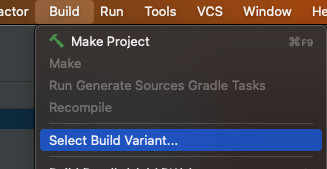
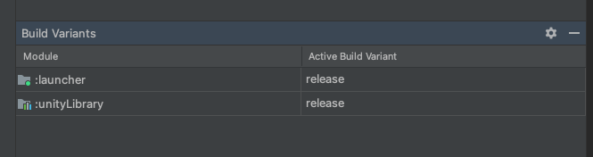
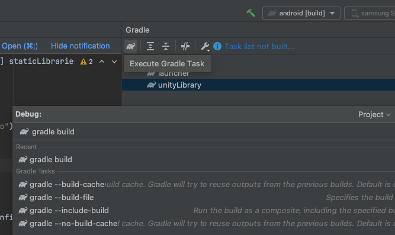
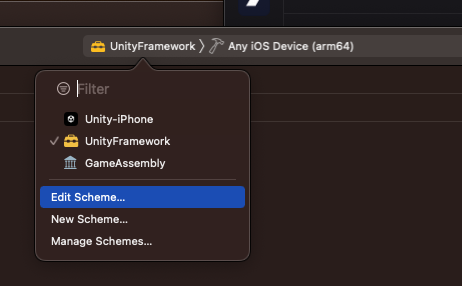
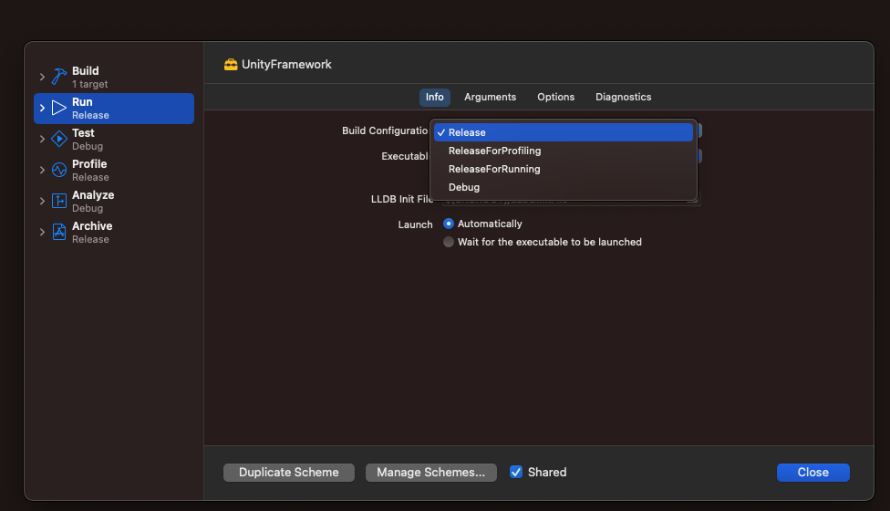
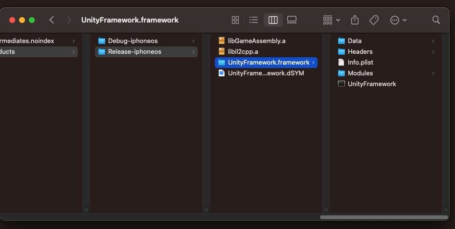

# Unity artifacts

Unity artifacts must be added before building the React Native app.

## Locations (in React Native app)

### Android

* `unity/android/unityLibrary-release.aar`

> The filename of the AAR can be edited in `build.gradle` located in the same directory, to switch between `debug` and `release` variants of your Unity artifact.

### iOS

* `unity/ios/UnityFramework.xcframework/ios-arm64/UnityFramework.framework` (Device SDK)
* `unity/ios/UnityFramework.xcframework/ios-x86_64-simulator/UnityFramework.framework` (Simulator SDK)

## Building Unity artifacts

### Android (Android Studio)

1. Export an Android project from Unity to somewhere on your computer.

2. Open the generated project in Android Studio.

3. Go to *Build Variants* and change *Active Build Variant* to *Release*:
   * 
   * 

4. Press *Execute Gradle Task* in the *Gradle* panel. Type in `gradle build` and execute.
   * 

5. Find `unityLibrary-release.aar` at `unityLibrary/build/outputs/aar/unityLibrary-release.aar`.

6. Copy this file into the React Native project.
   * `unity/android/unityLibrary-release.aar`

### iOS (Xcode)

1. Export an iOS project from Unity to somewhere on your computer.

2. Open the generated project in Xcode.

3. Go to *Edit Scheme* and change *Build Configuration* to *Release*:
   * 
   * 

4. Build the project:
   * <kbd>⌘</kbd> + <kbd>B</kbd>

5. Find the resulting framework by right-clicking *UnityFramework* in the project explorer and *Show in Finder*:
   * 
   * 

6. Copy this framework into the React Native project.
   * `unity/ios/UnityFramework.xcframework/ios-arm64/UnityFramework.framework`

7. Repeat steps 1 to 6 for iOS Simulator if necessary.
   * Make sure to select *Simulator SDK* in Unity player settings before exporting.
